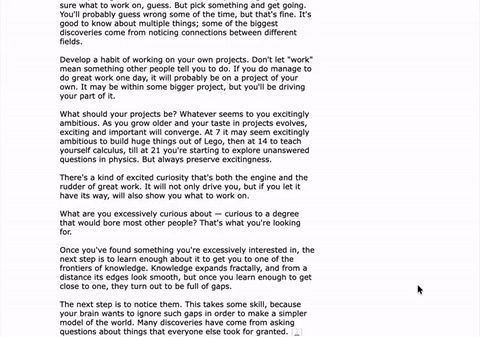

# Immersive Reading

A Claude Code / Codex skill for turning long-form material into cinematic
reading websites.

Example: Paul Graham's epic essay,
[How to Do Great Work](https://paulgraham.com/greatwork.html).

| Before | After |
| --- | --- |
| [](docs/media/how-to-do-great-work-before.mp4) | [](docs/media/how-to-do-great-work-after.mp4) |
| [Open full video](docs/media/how-to-do-great-work-before.mp4) | [Open full video](docs/media/how-to-do-great-work-after.mp4) |

## What It Builds

One source file becomes a local Reading Edition with:

- chapter and section structure
- cinematic openings and scroll transitions
- search, highlights, notes, and copyable notes
- optional bilingual line-by-line reading mode
- light and dark mode
- a static site you can run locally or deploy to Vercel

## Quick Start

<details open>
<summary><strong>Claude Code (recommended)</strong></summary>

Install from the public repo as a Claude Code plugin.

Run these as two separate Claude Code messages:

```text
/plugin marketplace add ryannli/immersive-reading
```

Then:

```text
/plugin install immersive-reading@immersive-reading
```

Use it in Claude Code with:

```text
/immersive-reading:immersive-reading
```

</details>

<details>
<summary><strong>Codex</strong></summary>

Codex uses this repo as a skill, not a plugin. Install it with:

```text
$skill-installer https://github.com/ryannli/immersive-reading/tree/main/skills/immersive-reading
```

Or use the npx installer:

```bash
npx --yes github:ryannli/immersive-reading install codex
```

</details>

<details>
<summary><strong>Cursor</strong></summary>

Install the skill resources and a project rule into the current project:

```bash
npx --yes github:ryannli/immersive-reading install cursor .
```

</details>

<details>
<summary><strong>Antigravity CLI</strong></summary>

```bash
agy plugin install https://github.com/ryannli/immersive-reading.git
```

</details>

<details>
<summary><strong>Claude Code without plugins</strong></summary>

```bash
npx --yes github:ryannli/immersive-reading install claude
```

</details>

<details>
<summary><strong>Other SKILL.md-compatible agents</strong></summary>

The `npx` commands run a small installer that copies `skills/immersive-reading`
into the target skills folder. They do not install app dependencies.

For a generic agent skills folder:

```bash
npx --yes github:ryannli/immersive-reading install agent
```

For a local clone:

```bash
git clone https://github.com/ryannli/immersive-reading.git
cd immersive-reading
sh setup codex
```

</details>

<details>
<summary><strong>Why is there a bin folder?</strong></summary>

`bin/immersive-reading.mjs` is the tiny installer used by the `npx` commands
above. It copies the bundled skill into Claude, Codex, Cursor, or a generic
agent skills directory. It is not part of generated reading websites.

</details>

## First Prompt

Open a new Claude Code or Codex session and ask:

```text
Use $immersive-reading to turn ./article.md into a Reading Edition at ./reading-edition.
Add Chinese bilingual mode.
```

For an English-only edition:

```text
Use $immersive-reading to turn ./essay.md into a Reading Edition at ./essay-reader.
No bilingual mode.
```

## License

MIT.
